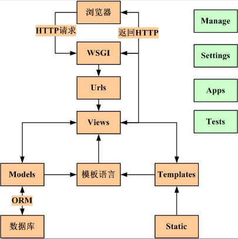
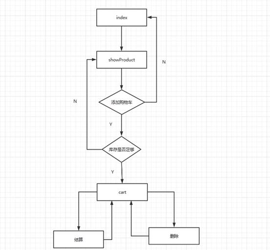
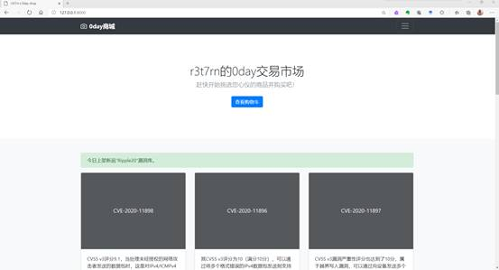
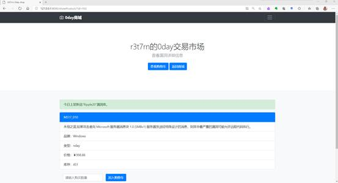
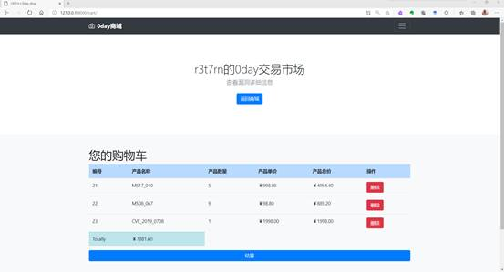

# PyShop

为了数据库课程而写的课设，一个基于Django和mysql的电商系统的实现。Django提供后端服务，bootstrap提供商城的前端展示，实现了添加购物车以及购买等操作。本软件基于django技术与mysql数据库，实现了一个界面美观，运行高效，操作便捷，有生产实用意义的在线商城系统。

## 安装

这个项目使用 [django](https://www.djangoproject.com/) 和 [mysql](https://www.mysql.com/)。请确保你本地安装了它们。

```sh
python -m pip install -r requests.txt
```


## 使用说明
先在/pyShopping/settings.py中修改DATABASES中的PASSWORD字段
再使用migrate构建数据库，再启动

```sh
python manage.py migrate
python manage.py runserver
```

之后访问 http://127.0.0.1:8000 即可

## 特性

* 基于Django，bootstrap和jQuery的web界面
* 实现对商品信息的展示
*  实现对商品的加入购物车操作
* 创建触发器，实现商品入库和被购买时自动修改库存数量
* 创建存储过程统计各种商品的库存、购买量等数据

## 结构与流程图

商城设计架构


Django流程


   


商城页面设计逻辑





## 示例

**商城主界面**



**查看商品详细界面**



**查看购物车并结算**



## 使用许可

[MIT](LICENSE) © r3t7rn